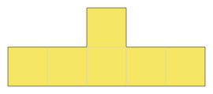

# dcc-tiler

### Basic tile terminology

There are currently two types of tiles supported, which are explained below.

#### `LTile`
An `LTile` of size `n` is the L-tetronimo with `n + 1` blocks.  For example
an`LTile` of size 3 is:


while an `LTile` of size 5 is:


#### `TTile`
A `TTile` of size `n` is the T-tetronimo with `2(n+1)` blocks.  For example, a `TTile` of size 1 is:


while a `TTile` of size 2 is:



### Basic board terminology

There are currently three supported boards: `Rectangle`, `LBoard`, and `TBoard`.  

#### `LBoard` and `TBoard`

There are two parameters that affect the shape/size of an L/T board: `board_size` and `board_scale`.
With these parameters, a tile (either L or T) of size `board_size` is created, and then each
box in this tile is replaced by `board_scale ** 2` boxes.

For example, an `LBoard` with size 4 and scale 1 looks like:


while bumping the scale up to 2 results in:


A `TBoard` with size 1 and scale 1 looks like:


while bumping the scale up to 2 results in:


#### `Rectangle`

There are two parameters that affect the shape/size of a rectangular board: `board_size` (height) and `width`.

For example, a `Rectangle` with `board_size = 3` and `width = 5` looks like:


While a `Rectangle` with `board_size = 6` and `width = 4` looks like:


*Note*: The scale parameter is ignored for `Rectangle`.

### Counting tilings of an LBoard by LTiles

The following command counts the number of tilings of an LBoard of size 2 by LTile's of size 2,
with scale parameter `x`:

`dcc_tiler_cli --count --scale x --board_type LBoard --tile_type LTile 2 2`

This results in the following tiling counts as `x` varies:

| `x` | Tilings           |
|-----|-------------------|
| 1   | 1                 |
| 2   | 1                 |
| 3   | 4                 |
| 4   | 409               |
| 5   | 108388            |
| 6   | 104574902         |
| 7   | 608850350072      |
| 8   | 19464993703121249 |

This sequence of integers (`1, 1, 4, 409, ...`) does not appear in the OEIS.

### Counting tilings of a TBoard by TTiles

The command here is:

`dcc_tiler_cli --count --scale x --board_type TBoard --tile_type TTile 1 1`

*Exercise:* Show that if `x > 1` and `x % 4 != 0` then there are no such tilings!

This results in the following tiling counts as `x` varies:

| `x` | Tilings   |
|-----|-----------|
| 1   | 1         |
| 4   | 54        |
| 8   | 655302180 |
| 12  | ?         |

#### Alternative approach

Instead of modifying the scale parameter each time, you can instead use the `--scaling` option as follows:

`dcc_tiler_cli --scaling --board_type TBoard --tile_type TTile 1 1`

which results in the following output:

```
scale(1), 1 tilings
scale(2), 0 tilings
scale(3), 0 tilings
scale(4), 54 tilings
scale(5), 0 tilings
scale(6), 0 tilings
scale(7), 0 tilings
scale(8), 655302180 tilings
...
```

### Counting tilings of an LBoard by TTiles

Many combinations are possible.  An example is:

`dcc_tiler_cli --count --scale 4 --board_type LBoard --tile_type TTile 3 1`

which counts 54 tilings.  An example of such a tiling is:


### Counting tilings of a rectangle by TTiles

Suppose we wanted to count how many ways there are to tile an `n x n` rectangle
using T-tetronimos of size 1.  The command here is:

`dcc_tiler_cli --count --board_type Rectangle --width n --tile_type TTile n 1`

which results in the following output:

| `n` | Tilings                |
|-----|------------------------|
| 4   | 2                      |
| 8   | 84                     |
| 12  | 78696                  |
| 16  | 1668091536             |
| 20  | 804175873700640        |
| 24  | 8840889502844537044800 |

which agrees with the table appearing in [C. Merino, 2008](https://ajc.maths.uq.edu.au/pdf/41/ajc_v41_p107.pdf).

### Generating a single tiling image

After counting the number of tilings, it is often useful to render an image of such a tiling for visual
inspection.  We know from the previous section that there are 54 tilings of an LBoard of size 3, scale 4
by TTile's of size 1.  To generate such a tiling, we use the `--single` option and pipe the output into `output.svg`:

`dcc_tiler_cli --single --scale 4 --board_type LBoard --tile_type TTile 3 1 > output.svg`

*Note*: The CLI generates at most 1000 tilings and then selects a single tiling to render from among them,
 so there is no guarantee that running this command repeatedly will generate all possible tilings.
 
### Generate all tiling images

Instead of generating a single image, you can also generate a ZIP file containing all tilings using the `--all <filename>` command.
For example:

`dcc_tiler_cli --all tilings.zip --scale 4 --board_type LBoard --tile_type TTile 3 1`

### Tiling graphs

It is possible to output all tiling data as a graph represented in JSON.  A 4x8 rectangular board is represented by
the JSON object:

```json
{ "board" : [ [false, false, false, false], 
              [false, false, false, false], 
              [false, false, false, false],
              [false, false, false, false],
              [false, false, false, false],
              [false, false, false, false],
              [false, false, false, false],
              [false, false, false, false], ] }
```

If we placed down a size 1 T-tetronimo  in the top left corner of the board, our new board would be:

```json
{ "board" : [ [true,  true,  true,  false], 
              [false, true,  false, false], 
              [false, false, false, false],
              [false, false, false, false],
              [false, false, false, false],
              [false, false, false, false],
              [false, false, false, false],
              [false, false, false, false], ] }
```

The tiling graph consists of the following:
 
 * An array `nodes_arena` consisting of board objects (as above),
 * An object `edges` of the form:
 ```json
{
    "0":  [ 1, 2 ],
    "1" : [ 3 ],
    "2" : [ 4 ],
    "3" : [ 5, 7, 8, 6 ],
}
```
* An object `rev_edges` of the form:
```json
{
    "1":  [ 0 ],
    "2" : [ 0 ],
    "3" : [ 1 ],
    "4" : [ 2 ],
    "5" : [ 3 ],
    "6" : [ 3 ],
    "7" : [ 3 ],
    "8" : [ 3 ],
}
```
* An array `complete_indices` of the form:
```json
[ 36 ]
```

Nodes in our graph correspond to the boards in `node_arena`, so the first entry in `nodes_arena` is node 0,
the second entry is node 1, and so on.  Node 0 is always the empty board (no tiles).  An edges `s -> t` between
two nodes indicates that you can get from board `s` to board `t` by placing down a tile.   Such an edge
is recorded in two places: in the `edges` object (so that `t` is in `edges[s]`), and in the `rev_edges`
object (so that `s` is in `rev_edges[t]`).  Finally, if a complete tiling is possible, its node will be stored in the `complete_indices`
array.  

*Things to note about tiling graphs:* 
* If there are a lot of tilings, generating the graph can take a *long time*, and the resulting graph will generally
be *large* and difficult to work with in memory.  This problem is what motivated the `--count` and `--single` commands, which avoid generating the entire tile graph.
* Given an edge `s -> t` we don't store any data on which tile must be placed down to get from board `s` to board `t`;
this can be recovered by looking at which entries switched from `false` to `true` in going from `s` to `t`.  

* Suppose you wanted to count the number of possible ways to tile a board.  Using the graph, one way to do this is as follows:
    * Initialize a hash map `count` with `count[0] = 1` (i.e. there is one way to tile the empty board).  
    * Initialize a hash set `current_layer` with node `0`.
   * While `current_layer` is nonempty:
        * Initialize an empty hash set `next_layer`.
        * For each node `s` in `current_layer`:
            * For each node `t` in `edges[s]`:
                * If `t` is not in `count`, set `count[t] = 0`.  
                * Increment `count[t]` by `count[s]`.
                * Add `t` to `next_layer`.
        * Set `current_layer = next_layer`.
    * The total number of tilings will be `count[final]`, where `final` is the node appearing in `complete_indices`.

### License

Licensed under either of

 * Apache License, Version 2.0
   ([LICENSE-APACHE](LICENSE-APACHE) or http://www.apache.org/licenses/LICENSE-2.0)
 * MIT license
   ([LICENSE-MIT](LICENSE-MIT) or http://opensource.org/licenses/MIT)

at your option.

### Contribution

Unless you explicitly state otherwise, any contribution intentionally submitted
for inclusion in the work by you, as defined in the Apache-2.0 license, shall be
dual licensed as above, without any additional terms or conditions.