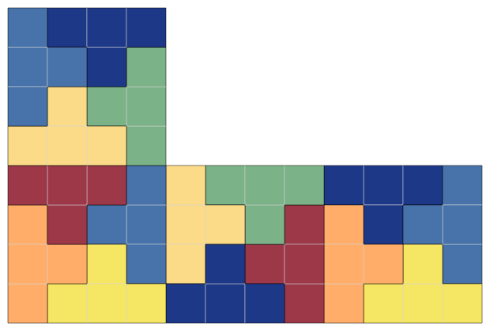

# dcc-tiler

### Basic tile terminology

There are currently two types of tiles supported, which are explained below.

#### `LTile`
An `LTile` of size `n` is the L-tetronimo with `n + 1` blocks.  For example
an`LTile` of size 3 is:


while an `LTile` of size 5 is:


#### `TTile`
A `TTile` of size `n` is the T-tetronimo with `2(n+1)` blocks.  For example, a `TTile` of size 1 is:


while a `TTile` of size 2 is:


### Basic board terminology

There are currently three supported boards: `Rectangle`, `LBoard`, and `TBoard`.  

#### `LBoard` and `TBoard`

There are two parameters that affect the shape/size of an L/T board: `board_size` and `board_scale`.
With these parameters, a tile (either L or T) of size `board_size` is created, and then each
box in this tile is replaced by `board_scale ** 2` boxes.

For example, an `LBoard` with size 4 and scale 1 looks like:


while bumping the scale up to 2 results in:


### Counting tilings of an LBoard by LTiles

The following command counts the number of tilings of an LBoard of size 2 by LTile's of size 2,
with scale parameter `x`:

`dcc_tiler_cli --count --scale x --board_type LBoard --tile_type LTile 2 2`

This results in the following tiling counts as `x` varies:

| `x` | Tilings           |
|-----|-------------------|
| 1   | 1                 |
| 2   | 1                 |
| 3   | 4                 |
| 4   | 409               |
| 5   | 108388            |
| 6   | 104574902         |
| 7   | 608850350072      |
| 8   | 19464993703121249 |

This sequence of integers (`1, 1, 4, 409, ...`) does not appear in the OEIS.

### Counting tilings of a TBoard by TTiles

The command here is:

`dcc_tiler_cli --count --scale x --board_type TBoard --tile_type TTile 1 1`

*Exercise:* Show that if `x > 1` and `x % 4 != 0` then there are no such tilings!

This results in the following tiling counts as `x` varies:

| `x` | Tilings   |
|-----|-----------|
| 1   | 1         |
| 4   | 54        |
| 8   | 655302180 |
| 12  | ?         |

#### Alternative approach

Instead of modifying the scale parameter each time, you can instead use the `--scaling` option as follows:

`dcc_tiler_cli --scaling --board_type TBoard --tile_type TTile 1 1`

which results in the following output:

```
scale(1), 1 tilings
scale(2), 0 tilings
scale(3), 0 tilings
scale(4), 54 tilings
scale(5), 0 tilings
scale(6), 0 tilings
scale(7), 0 tilings
scale(8), 655302180 tilings
...
```

### Counting tilings of an LBoard by TTiles

Many combinations are possible.  An example is:

`dcc_tiler_cli --count --scale 4 --board_type LBoard --tile_type TTile 3 1`

which counts 54 tilings.  An example of such a tiling is:



### Generating a single tiling image

After counting the number of tilings, it is often useful to render an image of such a tiling for visual
inspection.  We know from the previous section that there are 54 tilings of an LBoard of size 3, scale 4
by TTile's of size 1.  To generate such a tiling, we use the `--single` option and pipe the output into `output.svg`:

`dcc_tiler_cli --single --scale 4 --board_type LBoard --tile_type TTile 3 1 > output.svg`

*Note*: The CLI generates at most 1000 tilings and then selects a single tiling to render from among them,
 so there is no guarantee that running this command repeatedly will generate all possible tilings.
 
### Generate all tiling images

Instead of generating a single image, you can also generate a ZIP file containing all tilings using the `--all <filename>` command.
For example:

`dcc_tiler_cli --all tilings.zip --scale 4 --board_type LBoard --tile_type TTile 3 1`